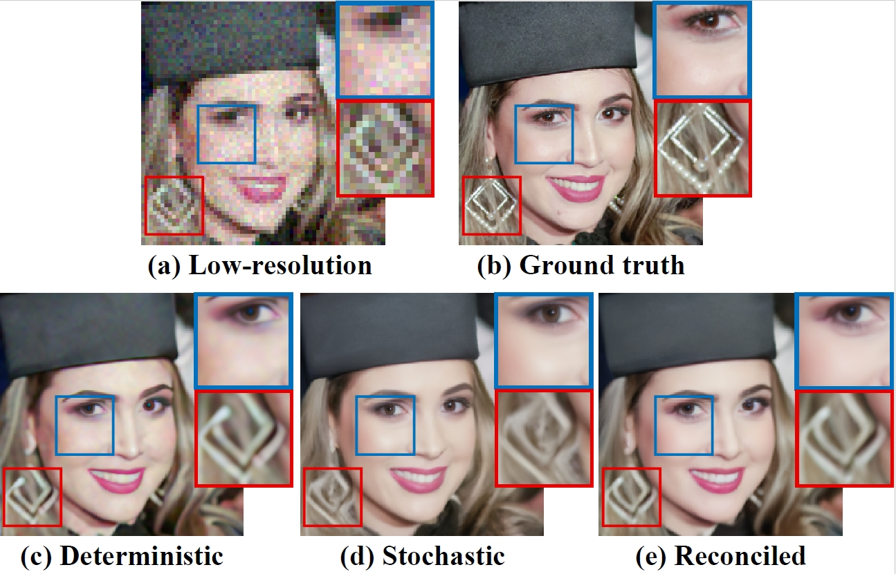

# [CVPR 2025] Reconciling Stochastic and Deterministic Strategies for Zero-shot Image Restoration using Diffusion Model in Dual
This is the official implementation of the CVPR 20245 paper 
["Reconciling Stochastic and Deterministic Strategies for Zero-shot Image Restoration using Diffusion Model in Dual"]("https://openaccess.thecvf.com/content/CVPR2025/papers/Wang_Reconciling_Stochastic_and_Deterministic_Strategies_for_Zero-shot_Image_Restoration_using_CVPR_2025_paper.pdf")

*Chong Wang, Lanqing Guo, Zixuan Fu, Siyuan Yang, Hao Cheng, Alex C. Kot, Bihan Wen*

>  ### Abstract
> *Plug-and-play (PnP) methods offer an iterative strategy for solving image restoration (IR) problems in a zero-shot manner, using a learned discriminative denoiser as the implicit prior. More recently, a sampling-based variant of this approach, which utilizes a pre-trained generative diffusion model, has gained great popularity for solving IR problems through stochastic sampling. The IR results using PnP with a pre-trained diffusion model demonstrate distinct advantages compared to those using discriminative denoisers, i.e.,improved perceptual quality while sacrificing the data fidelity. The unsatisfactory results are due to the lack of integration of these strategies in the IR tasks. In this work, we propose a novel zero-shot IR scheme, dubbed Reconciling Diffusion Model in Dual (RDMD), which leverages only a single pre-trained diffusion model to construct two complementary regularizers. Specifically, the diffusion model in RDMD will iteratively perform deterministic denoising and stochastic sampling, aiming to achieve highfidelity image restoration with appealing perceptual quality. RDMD also allows users to customize the distortionperception tradeoff with a single hyperparameter, enhancing the adaptability of the restoration process in different practical scenarios. Extensive experiments on several IR tasks demonstrate that our proposed method could achieve superior results compared to existing approaches on both the FFHQ and ImageNet datasets.*
<!--  -->

### Sorry the codes are a little messy now and we are currently cleaning the codes. The instruction will be updated soon.
